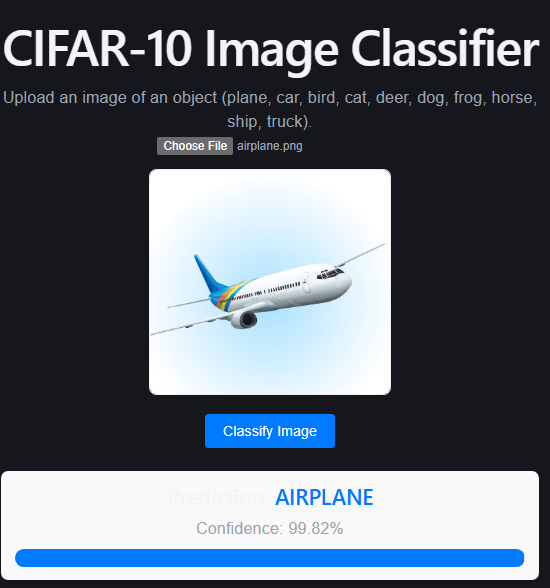
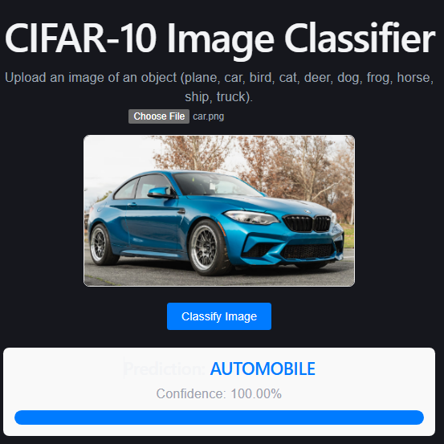
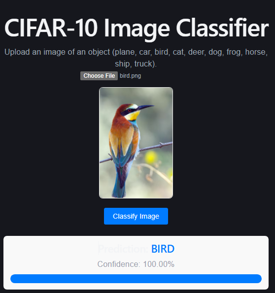
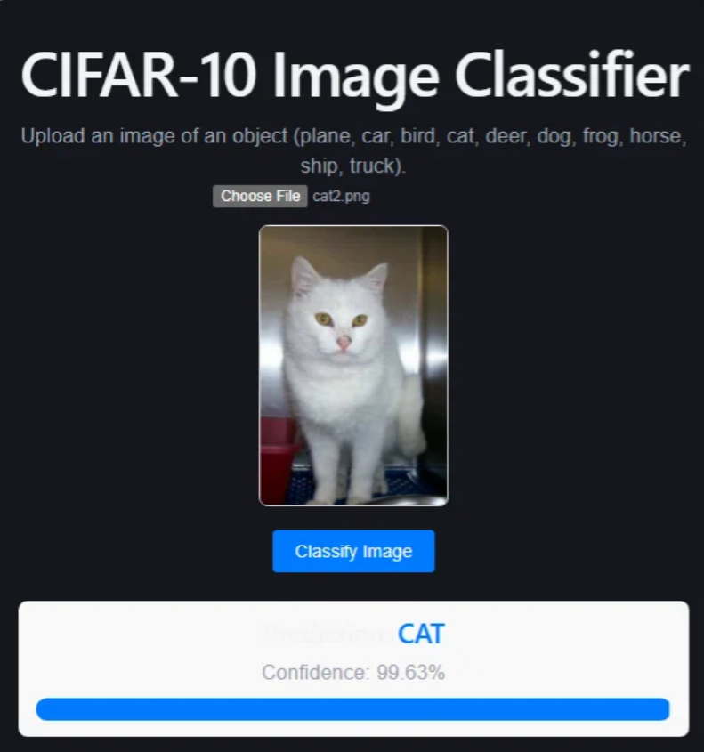
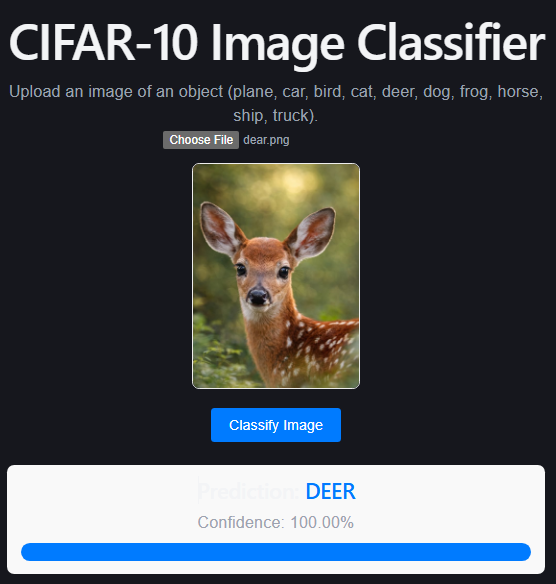
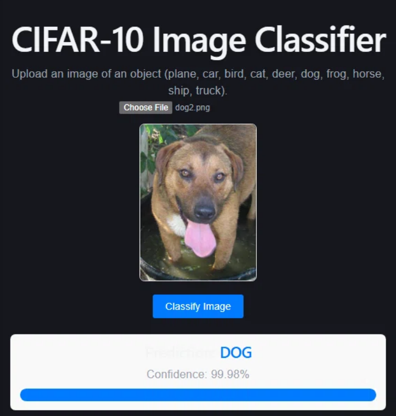
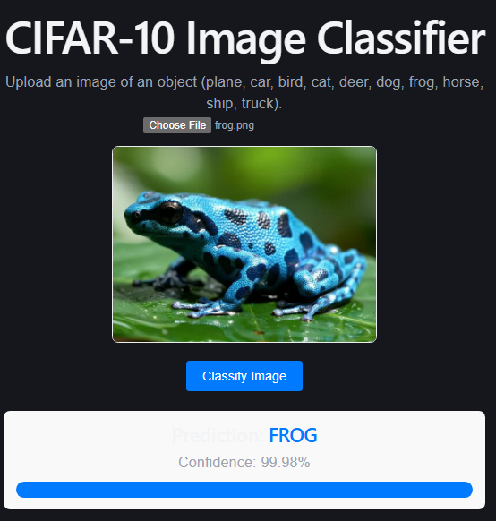
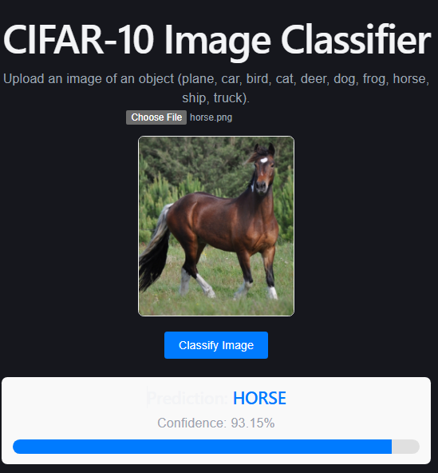
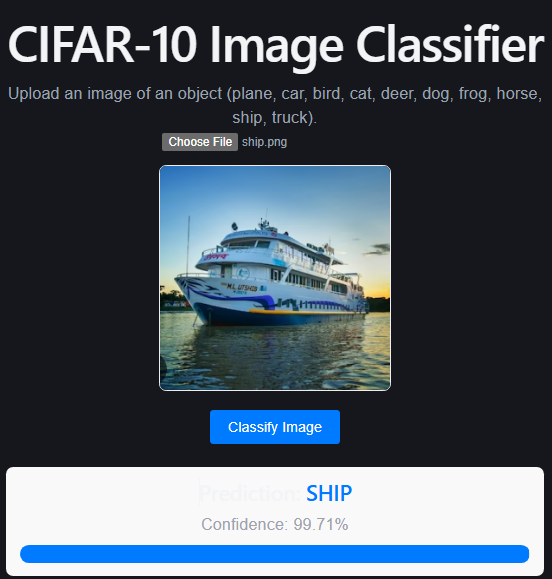
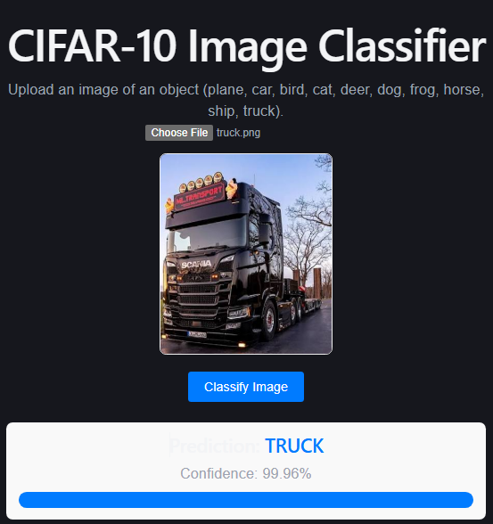

# CIFAR-10 Image Classifier

🔗 **Live demo:** https://capstone-project-sk-vision-ui.vercel.app
🔗 **API:** https://capstone-project-sk-vision-api.onrender.com
🔗 **API docs:** https://capstone-project-sk-vision-api.onrender.com/docs

**Stack:** MobileNetV2 transfer learning (TFLite, 2.5 MB) · FastAPI on Render · React (Vite) on Vercel

> ⚠️ Free tier: backend spins down after 15 min of inactivity. First request may take ~50s.

---


# CIFAR-10 Image Classifier — v1.0

An end-to-end Deep Learning web application that classifies images into 10 categories using Transfer Learning (MobileNetV2).

## Architecture
React (Vite) -> Express Gateway (Port 5000) -> FastAPI (Port 5001) -> TensorFlow/Keras Model

## Demo & Screenshots

| Class | Prediction | Class | Prediction |
| :---: | :---: | :---: | :---: |
| **Airplane** |  | **Automobile** |  |
| **Bird** |  | **Cat** |  |
| **Deer** |  | **Dog** |  |
| **Frog** |  | **Horse** |  |
| **Ship** |  | **Truck** |  |

## Model Comparison & Selection

| Model | Algorithm | Accuracy | F1 Score | Train Time | Predict Time | Model Size |
| :--- | :--- | :--- | :--- | :--- | :--- | :--- |
| Baseline | From-Scratch CNN | 0.6748 | 0.6748 | 72.76s | 2.32s | ~2 MB |
| **Transfer Learning (Winner)** | MobileNetV2 (fine-tuned) | **0.8741** | **0.8734** | 745.21s | 27.30s | ~21 MB |

**Justification:**
MobileNetV2 gave up roughly 20 percentage points of accuracy, 19 MB of disk space, and a ~10x slower inference time compared to the from-scratch baseline. However, the ~20 point accuracy gain (67% → 87%) is absolutely worth the extra resources for an image classifier where accuracy is the primary requirement.

**The Hosting Gotcha (Pre-documented):**
TensorFlow is heavy (~500MB). Render's free 512MB tier will OOM. The recommended deployment strategy is to use `tensorflow-cpu` only, or convert the model to `.tflite` and use `tflite-runtime` (which is <5MB). For this local demo, we serve the full `.keras` model.

## How to Run

### 1. Start the FastAPI Service (Terminal 1)
```powershell
.\.venv\Scripts\python.exe api\main.py